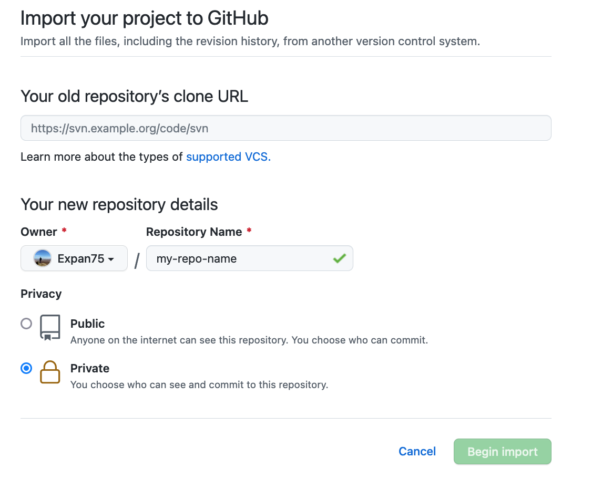

# CFG Nano Submission guide and template

Hello! Welcome to the Nano degree submission template! This README will briefly go over a standardised way of submitting. The main reason for standardising and using a combination of .py, .sql, and .md* (markdown) files is that they are all rendered in the normal GitHub Pull request flow. This allows instructors to give line-by-line feedback which is identical to what you would recieve while working in a team and having a coworker review your code contribution via pull request.

*If you're wondering what markdown is, please see the MARKDOWN.md file!

## How are homeworks structured?
Homeworks tend to be structured in sections (called tasks) with potentially multiple questions per section. These questions might touch on anything from python, to sql, to anything in your specialisation (software principles, machine learning etc.).

Depending on the question, you may be asked to write your answer as code. If so, do make sure your code is runable (i.e., but it in a .py file if it's python code).
## Why not use pdf:s, word, or pages?
Two reasons:
- GitHub Rendering: GitHub unfortunately does not render them not allowing line-by-line feedback.
- Compability issues: pdf less so, but word and pages require either the instructor to have that particular software which is restrictive (cannot install pages on linux etc.) OR a lengthy process to upload the file to google docs as a conversion step (opening it as a google doc instead).

# Using this template

The easiest way of using this template is to clone this repository and use it as a workspace for your homeworks. To do so, you'll need a terminal and some commands.

1. Fork the template repository on GitHub via import

    Forking a repository is the act of a cloning a remote directory to another remote directory. This allows you to create an identical copy in your own GitHub account.

    To fork a repository on Github, login to Github and click "new" (see the repositories tab or view). After clicking view, click the that says "<a href="#">Import a repository</a>" (close to the top of the screen.)

    Your screen should now look like this:
    
    

    In the old repository, enter the url of the template repo, i.e.: https://github.com/Expan75/cfg-homework-template. 
    
    In the repository name field, feel free to name the repository anything you want; short and descriptive is usually preferred!

    Lastly, make sure you enter "private" as the privacy level. This is to ensure that you don't accidentally reveal answers to your classmates which will get you flagged for cheating.

    Now hit "begin import"! Note that it might take a little while for this duplication process to complete (~1min).

2. You now have a fork repo under your own GitHub account! Verify this by navigating your to GitHub account and look for the newly created repository in the list of repositories and navigate into the repo. You can leave this browser tab open for now.

3. The remaining steps aims to also create a local copy of the remote repository so that you can work on it and upload changes. For this, open a terminal:
    - Windows: use gitbash (see installation here: https://gitforwindows.org/, it's part of the git install).
    - MacOS: use the regular terminal (cmd+space and search for 'terminal' and hit enter).

4. Navigate to wherever you want to create the directory containing the repository.

    The terminal you've opened uses linux/posix commands to change directories and move around in your system. Use a combination of the commands below to navigate to wherever you want to create your directory. Commands are whatever follows the "$" in the below box. Comments are marked with "#". Note that "directory" and "folder" is used interchangably.

    ```
    # Check where in the system you currently are.
    $ pwd

    # Step out of a directory (into the parent directory).
    $ cd ..

    # Step into a directory (note the difference in OS)

    # mac/linux
    $ cd folder
    $ cd /my/path/to/some/DistantFolder

    # windows
    $ cd folder
    $ cd \my\path\to\some\DistantFolder
    ```

    It can be useful to open a file explorer (e.g. finder on macos) to check where things are if you are not used to using a terminal to navigate around!

5. Once in a spot where you want to create your homework directory, use git to clone the repository. Feel free to change the name of the directory to whatever you like! I.e. instead of cfg-homework, call it myhomeworkdirectory.

    ```
    $ git clone git@github.com:{{your-github-username}}/{{your-forked-repo-name}}.git cfg-homework
    ```

    You can keep the terminal open for now (you'll need it in a bit!).

6. Now you can open the homework folder in your editor of choice and start working! Before that though, you need to create a new remote repository on GitHub to be able to backup and share your work (and for it to be marked).

**You can now open this in your editor of choice and proceed to work on the homework!**

# Working on a new homework assignment

This part of the guide assumes you've followed the steps outlined above.

1. The first thing to do when starting work on new homework assignments, is to create a new branch using git using the cli:

    ```
    $ git checkout -b week2
    ```
    This creates and changes your branch from the default (main) to week2. Note that "week2" could be any name; its just to identify the branch.

2. After creating the branch, you can create a new folder to contain everything that will go into the submission. Here's its recommended to follow the naming scheme: e.g. for homework due in the second week of the foundation, make a folder called "foundation-week-2".

3. In the homework folder, feel free to create the files you need to answer the questions, be it markdown or code. Don't forget to regularly commit and push if you want to backup your work! E.g., adding and pushing changes would look something like this:
    ```
    # add and commit my newly created python code for task 1.
    $ git add t1q1.py
    $ git commit -am t1q1.py "add answers for task 1, question 1"
    # Note that the branchname may be different if you used something else when using the checkout command.
    $ git push -u origin week2
    ```

